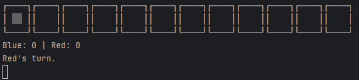
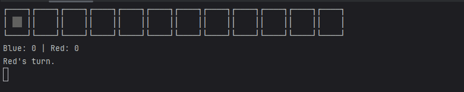
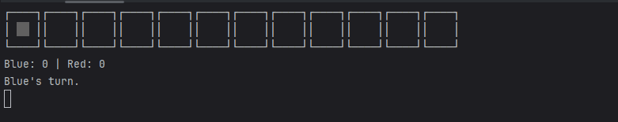
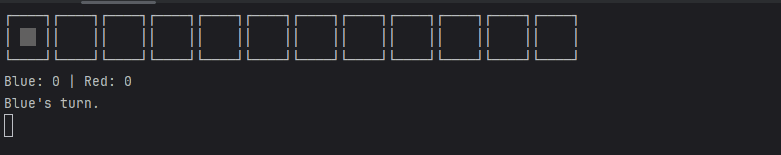
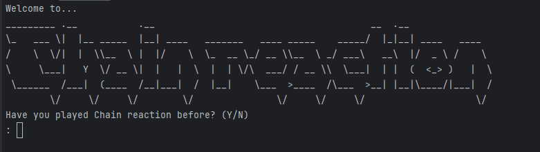
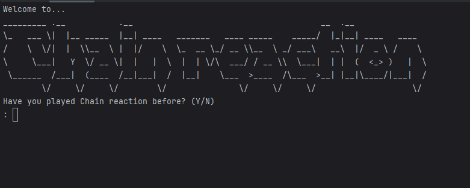
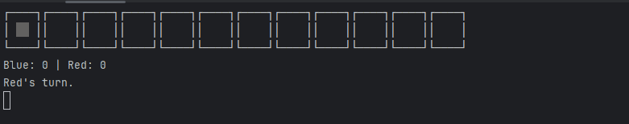

# Results of Testing

The test results show the actual outcome of the testing, following the [Test Plan](test-plan.md)

---

## Input: Keyboard - **VALID**

I will test that I can move my selection on the board and place counters,
using the keyboard

### Test Data Used

I will press the right arrow key 3x then the left arrow key 3x and then the up arrow key.

### Test Result

---

## Input: Keyboard - **INVALID**

I will test my program's reaction to multiple invalid keypresses

### Test Data Used

I will press every key on the keyboard

### Test Result

Note: There is no visible changes when the game rejects an input.
The only visible indicator is the refreshing of the board.

---

## Input: Selection - **VALID**

I will test if I can place counters on the board

### Test Data Used

I will attempt to place a counter in a valid spot on the board

### Test Result

Comment on test result. Comment on test result. Comment on test result. Comment on test result. Comment on test result.
Comment on test result.

---

## Input: Selection - **BOUNDARY**

I will test if I can select and place counters in the cells at the edges of the board

### Test Data Used

I will attempt to place counters at either end of the board

### Test Result

Comment on test result. Comment on test result. Comment on test result. Comment on test result. Comment on test result.
Comment on test result.

---

## Input: Selection - **INVALID**

I will test if the code prohibits me from attempting to select a cell outside the bounds of the board

### Test Data Used

I will use the arrowkeys to attempt to navigate past the righthandside and lefthandside of the board.

### Test Result

Note: there is no visible change to the board while attempting to move past the boundaries.
The only indicator is the brief refresh of the board after every attempt to move past.

---

## Input: Selection - **INVALID**

I will test if the game prohibits me from placing a counter in an invalid spot.

### Test Data Used

I will attempt to place a counter between 2 opponent counters and
attempt to place a counter on top of a preexisting counter.

### Test Result

Note: There is no visible change when the game denies a placement.
The only indicator is the board refresh after every attempt.

---

## Input: yesOrNo function - **VALID**

I will test if the yesOrNo function that is used to ask the user whether they want to play against a bot/know the rules
accepts valid inputs

### Test Data Used

I will answer Y to "Have you played Chain Reaction before? (Y/N)"
I will answer N to "Would you like to play against a bot? (Y/N)"

### Test Result

I was able to control both players so the bot was inactive

---

## Input: yesOrNo function - **INVALID**

I will test if the yesOrNo function that is used to ask the user whether they want to play against a bot/know the rules
rejects invalid inputs

### Test Data Used

I will answer "   " to "Have you played Chain Reaction before? (Y/N)"
I will answer "" to "Have you played Chain Reaction before? (Y/N)"
I will answer qrwtw to "Have you played Chain Reaction before? (Y/N)"
I will answer wowza to "Have you played Chain Reaction before? (Y/N)"

### Test Result

---

## Gameplay: Counter removal when bordered by opponent counters

I will test if the game correctly removes counters that become surrounded by opponent counters

### Test Data Used

I will place a counter next to an opponent counter and allow the opponent to place a counter to surround me

### Test Result

---

## Gameplay: Scoring

I will test if the code correctly recognizes counter chains and assigns points correctly

### Test Data Used

I will create a chain of 3+ counters

### Test Result

---

## Gameplay: Win condition

I will test if the game triggers the win/stalemate condition upon either:
A player gets >= 10 points or the current player has no legal move

### Test Data Used

I will trigger a stalemate then
I will allow myself to lose, and finally
I will win a game

### Test Result

Note: The stalemate message was triggered because both players had an equal score.
if this was not the case the player with the most points would be labeled as the victor
---

